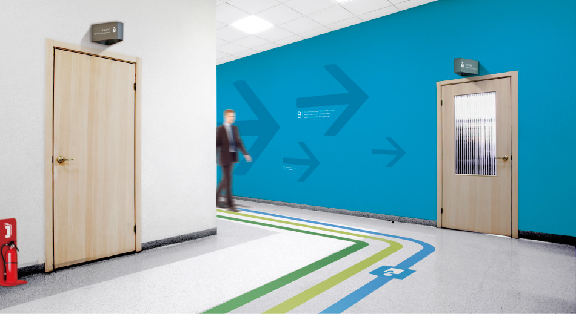

# Indoor Navigation in Hospitals
Our project aims at **enabling indoor navigation for patients and visitors in hospitals worldwide**.

Image taken from [here](https://www.behance.net/gallery/4217139/Hospital-signage).

We solve the indoor navigation problem by mapping the hospital as a graph with nodes 
representing rooms and passages, and edges connecting the nodes together.

Visitors can ask for navigation using a browser-powered terminal, a web page on their mobile phone or an app. 
All of them connect to the same backend. 
The backend indexes rooms by names (and additional information like telephone numbers) 
and provides navigation to the user. The digital indoor navigation will reduce 
time doctors and nurses spend on guiding patients who lost their way in the hospital, 
and increase the patients' experience while staying at the hospital. 
Both factors contribute enormously towards the patient-centered medicine of the 21st century.

## Background

This project has been created during 
the [first Indoor Navigation Hackathon](https://www.meetup.com/HealthhackersER/events/245069169/) 
on December 2nd, 2017, in Pferdestall, Erlangen. 
A word of enormous gratitude goes to [Health Hackers Erlangen](http://healthhackers.de) 
for the organization of this hackathon.

During the hackathon, we tested the navigation using a graph with 14 nodes and 6 rooms based on the building map 
(the main entrance is on the far left):

## Technical
Our project is proud to be powered by Python 3. Tested with [Python 3.5.1](https://www.python.org/downloads/release/python-351/).

We use the following libraries:
- [networkx v.2.0](https://networkx.github.io)

## How to use

Our project consists of a back-end and a front-end components.

### 1. Back-end

The back-end is implemented as a series of independent Python services. The services bind to a web socket and listen to incoming requests. In this fashion, the services are easily scalable and replaceble.

To run the example setup, start the following services:
- the search service  ([`server.py`](https://github.com/pdyban/indoor-navigation/blob/master/roomsearchservice/server.py))

  enables to search for a room in the digital map of the hospital, by its name
  
  run `python roomsearchservice/server.py`
  
  This service will run at `localhost` and listen to port `7777` by default.
  
- the routing service ([`server.py`](https://github.com/pdyban/indoor-navigation/blob/master/routingservice/server.py))

  enables to find the shortest path (not necessarily in the sense of distance, 
  but the one which maximize's the patient's utility) through the hospital map
  represented as an undirected graph. This services expects input as a tuple of (source, target) nodes.
  The nodes are passed using NodeIDs. The NodeIDs can be retrieved using the search service.
  
  run `python routingservice/server.py`
  
  This service will run at `localhost` and listen to port `8765` by default.
  
### 2. Front-end

After you started the back-end services (see above), you may connect any application to speak to the sockets.

This project implements an example front-end implementation:

  [`client.py`](https://github.com/pdyban/indoor-navigation/blob/master/routingservice/client.py) contains an example implementeation of a routing service client in Python. 
  
  [`client.html`](https://github.com/pdyban/indoor-navigation/blob/master/client.html) contains an example implementation of a front-end interface to the room search and routing services, in the browser.

### 3. Tests

All packages are implemented inspired by the TDD principles. 
All services are testable. 
